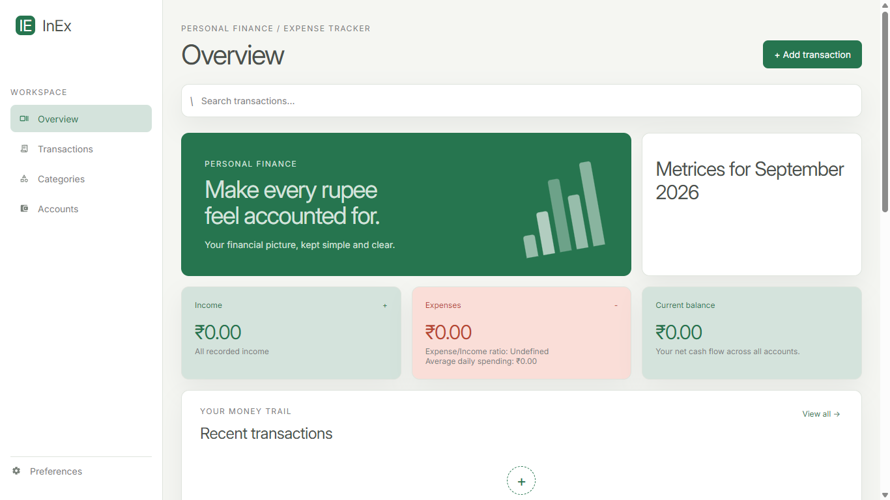

# InEx Finance Tracker

[InEx](https://saurabhv749.github.io/inex/) is a lightweight personal finance and expense-tracking application for keeping income, spending, accounts, and categories in one clear place.



The project is designed for people who want a simple view of their financial activity without the overhead of a large finance platform. It provides a focused workspace for recording transactions, reviewing spending patterns, managing accounts and categories, and adjusting personal preferences.

## Why This Matters

Financial clarity is easier to maintain when recording an expense takes very little effort and the resulting information is easy to understand. A small, focused tracker can help users:

- Build a consistent habit of recording income and expenses.
- Understand where money is going over time.
- Compare spending across days, months, and categories.
- Keep account and category information organized.
- Make decisions from their own data rather than relying on memory.

[InEx](https://saurabhv749.github.io/inex/) aims to make that daily workflow approachable, readable, and practical.

## Features

- Overview dashboard for income, expenses, balance, and spending activity.
- Transaction creation, filtering, searching, editing, and deletion.
- Account management.
- Income and expense category management.
- Spending comparison and category breakdown views.
- Import and export of application data.
- Currency and theme preferences.
- Responsive layout for desktop and smaller screens.

## Technology

- React
- TypeScript
- Parcel

## Requirements

Before installing the project, make sure you have:

- Node.js 18 or newer.
- npm 9 or newer.
- Git, if you are cloning the repository.

You can check your installed versions with:

```bash
node --version
npm --version
```

## Local Installation

1. Clone the repository and enter the project directory:

   ```bash
   git clone <repository-url>
   cd inex
   ```

2. Install the dependencies:

   ```bash
   npm install
   ```

3. Start the local development server:

   ```bash
   npm run start
   ```

4. Open the local URL printed by Parcel in your browser.

The application stores its development data locally in the browser. That means data created in one browser profile is not automatically shared with another browser or device. Use the built-in data export when you need a backup or transfer.

## Available Commands

### Development

```bash
npm run start
```

Starts Parcel in development mode with rebuild support.

## Project Layout

The repository is organized around the application entry point, reusable interface components, shared models and constants, and small utility modules for persistence, currency formatting, files, and CSV handling.

```text
src/
  components/    Reusable application views and interface components
  utils/         Shared data, file, currency, and storage helpers
  icons/         App icons
  hooks/         Hooks for managing app state and transaction filters
  context/       Modal context used by app
  pages/         Page views
  App.tsx        Application composition
  models.ts      Shared data models
  constants.ts   Shared application constants
  App.css        Application styling
  index.tsx      Browser entry point
  index.html     HTML entry point
```

## Contributing

Contributions are welcome. Useful contributions include bug fixes, accessibility improvements, visual refinements, documentation updates, and improvements to data import or export workflows.

## Bug Reports and Feature Requests

When reporting a bug, include:

- A concise description of the problem.
- Steps to reproduce it.
- The expected and actual behavior.
- A screenshot or console error when useful.

For feature requests, explain the user problem first, then describe the proposed solution. This helps keep the project focused on useful financial workflows rather than adding complexity for its own sake.